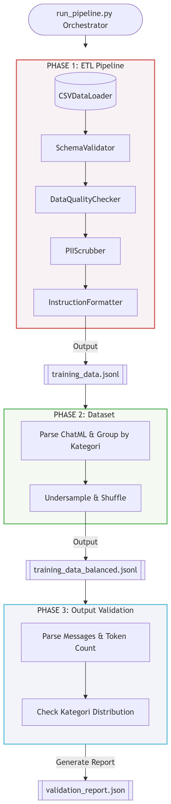

# Data Preparation Pipeline

Pipeline otomatis untuk mempersiapkan dataset kesejahteraan (contoh: Jawa Timur) agar siap digunakan untuk analisis dan pelatihan model (ML / LLM). README ini menjelaskan arsitektur, alur, konfigurasi, dan cara menjalankan pipeline secara lengkap.

---

## Ringkasan singkat
- Entrypoint: [run_pipeline.py](run_pipeline.py)
- Tiga fase utama: ETL → Rebalancing → Validation
- Output akhir: `data/processed/training_data_balanced.jsonl` (format JSONL, ChatML-style)

---

## Struktur proyek (highlight)
```
configs/
src/
   ingestion/
   labeling/
   security/
   transformation/
   validation/
data/
   raw/
   processed/
   logs/
run_pipeline.py
requirements.txt
.env
```

Lihat file konfigurasi di `configs/` dan modul utama di `src/`.

---

## Alur Pipeline (detail)

1) Persiapan & environment
- `run_pipeline.py` membuat direktori log, memeriksa `DATA_SALT`, dan mengatur path input/output.

2) Fase 1 — ETL (`src/transformation/etl_pipeline.py`)
- Sumber: [data/raw/dataset_kesejahteraan_jatim.csv](data/raw/dataset_kesejahteraan_jatim.csv)
- Komponen:
   - `CSVDataLoader` ([src/ingestion/csv_loader.py](src/ingestion/csv_loader.py)) membaca CSV secara chunked.
   - `SchemaValidator` ([src/validation/schema_validator.py](src/validation/schema_validator.py)) memeriksa kolom, tipe, dan rentang nilai.
   - `DataQualityChecker` ([src/validation/quality_checker.py](src/validation/quality_checker.py)) memeriksa kelengkapan, duplikasi, outlier; mendukung auto-clean.
   - `PIIScrubber` ([src/security/pii_scrubber.py](src/security/pii_scrubber.py)) meng-hash atau menghapus field PII sesuai `security_config.yaml`.
   - `InstructionFormatter` ([src/labeling/instruction_formatter.py](src/labeling/instruction_formatter.py)) memformat record menjadi ChatML/JSON untuk training.
- Proses per chunk:
   1. Sanitasi (hapus koma, casting numeric)
   2. Validasi schema (drop invalid rows menggunakan mask)
   3. Quality checks + auto-clean; simpan laporan per chunk ke `data/processed/quality_reports/`
   4. Scrub PII
   5. Format ke ChatML dan append ke `data/processed/training_data.jsonl`

3) Fase 2 — Rebalancing (`src/transformation/rebalance_dataset.py`)
- Baca `training_data.jsonl`, ekstrak field `kategori` dari isi pesan assistant, kelompokkan per kategori, lakukan undersampling untuk kelas mayoritas hingga `target_per_class` (default 100000), shuffle, dan simpan ke `data/processed/training_data_balanced.jsonl`.

4) Fase 3 — Output Validation (`src/validation/validate_output.py`)
- Validasi integritas ChatML (presence `messages` dan per-role content), hitung distribusi kategori, lakukan token-budget checks, hasilkan `data/processed/validation_report.json`. Jika ada pemeriksaan penting gagal → pipeline exit dengan error.

---

## Diagram alur



---

## Quickstart

1. Install dependency:

```bash
pip install -r requirements.txt
```

2. Siapkan `.env` (contoh):

```
DATA_SALT=replace_with_secure_random_string
```

3. Siapkan folder data dan letakkan CSV mentah:

```bash
mkdir -p data/raw data/processed data/logs
# letakkan dataset CSV di data/raw/dataset_kesejahteraan_jatim.csv
```

4. Jalankan pipeline (default menjalankan semua fase):

```bash
python run_pipeline.py
```

Opsi pengembangan (contoh memanggil ETL manual dari REPL):

```python
from src.transformation.etl_pipeline import ETLPipeline
pipeline = ETLPipeline(config_dir='configs')
pipeline.run(input_path='data/raw/dataset_kesejahteraan_jatim.csv', output_dir='data/processed', chunk_size=10000)
```

---

## Konfigurasi penting

- `configs/data_schema.yaml` — mendefinisikan kolom, tipe, required, min/max, allowed_values.
- `configs/labeling_config.yaml` — template reasoning, mapping kategori, format output.
- `configs/security_config.yaml` — daftar `pii_fields` dan aksi (`hash`, `remove`, `keep`).
- `configs/pipeline_config.yaml` — (opsional) nilai default seperti `chunk_size`, `target_per_class`.

Contoh minimal `security_config.yaml`:

```yaml
pii_fields:
   - field: nama
      action: remove
   - field: nik
      action: hash
      reason: audit_required
```

---

## Output & Artifak

- `data/processed/training_data.jsonl` — hasil ETL sebelum balancing
- `data/processed/training_data_balanced.jsonl` — hasil rebalancing siap training
- `data/processed/pipeline_log.json` — ringkasan metrik run
- `data/processed/scrub_log.json` — audit trail PII scrub
- `data/processed/quality_reports/` — quality report per chunk
- `data/logs/pipeline.log` — log eksekusi

---